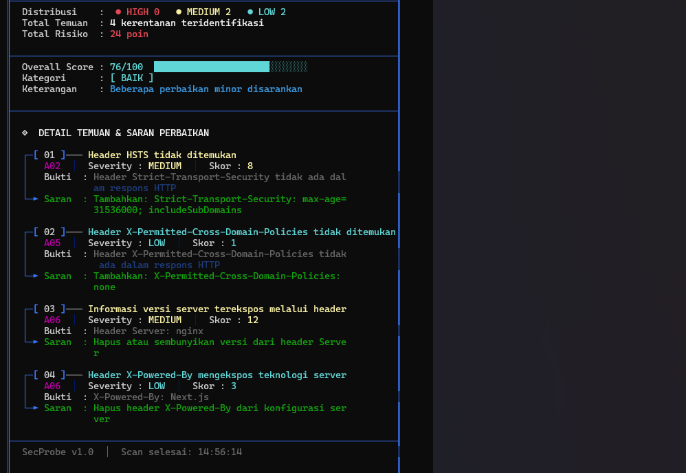

# SecProbe

**A Python-based CLI scanner for evaluating website security against the OWASP Top 10.**


## Demo





## Overview

SecProbe is a command-line tool for testing websites against OWASP Top 10 categories. You can scan all modules at once or pick specific ones, then save the results to a report file.

## Features

- Scan by OWASP Top 10 module (e.g. `A02`, `A06`)
- Scan all modules or only the ones you select
- Colored terminal output (colorama)
- Save scan results to a `.txt` report file

## Responsible Use

Use SecProbe only on websites you own or have written permission to test. Scanning without authorization may violate the law and applicable terms of use.

For practice, you can use a deliberately vulnerable demo site: `https://demo.testfire.net`

## Installation

1. Install [Python 3.10+](https://www.python.org/downloads/)
2. Clone the repo and install the dependencies:

```bash
git clone https://github.com/rmiftah/secprobe.git
cd secprobe
pip install -r requirements.txt
```

## Usage

Scan all modules:

```bash
python secprobe.py --url https://example.com
```

Scan specific modules:

```bash
python secprobe.py --url https://example.com --modul A02 A06
```

Scan and save a report:

```bash
python secprobe.py --url https://example.com --output laporan.txt
```

### Options

| Option     | Description                                                  |
| ---------- | ------------------------------------------------------------ |
| `--url`    | Target URL to scan                                           |
| `--modul`  | Select specific OWASP modules (optional, accepts multiple)   |
| `--output` | Save scan results to a file (optional)                       |

## Troubleshooting

### `ModuleNotFoundError: No module named 'requests'`

The library isn't installed. Run:

```bash
pip install -r requirements.txt
```

### `python` is not recognized

Try `python3 secprobe.py ...` or make sure Python is added to your PATH.

## License

Released under the MIT License. See the [LICENSE](LICENSE) file.

## Author

Tools by Miftah
